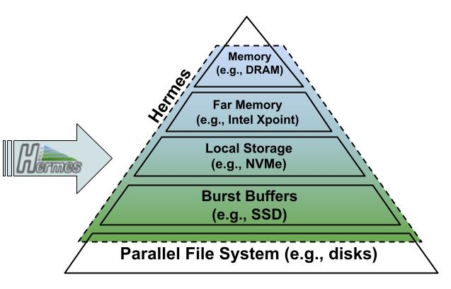

# Main Scenario

:::info

Hermes **1.1.0** is now available! [Download
now](https://github.com/HDFGroup/hermes/releases) for the latest features and
improvements. For more information, visit the [Hermes project
page](/research/projects/hermes).

:::

Consider an HPC cluster equipped with a [deep memory and storage
hierarchy](components/examples) (DMSH), the bottom layer of
which is typically a parallel file system (PFS). DMSH was introduced to
boost or to at least improve the I/O (POSIX, MPI-IO, HDF5, ...)
performance of applications performing poorly otherwise. Unfortunately,
DMSH is not a turn-key solution and difficult to use from a developer's or user's
perspective. It seems that users are expected to
take control, to learn all the necessary DMSH details, and to make the
necessary code changes. Even if successful, this is a distraction from
solving domain problems and, worse, it will be harder to maintain and
port the application to other or future systems.

The goal of the Hermes project is to provide a _seamless_ solution that
utilizes DMSH none or minimal changes to applications.

(Even without a deep DMSH, determined users have created original
solutions to overcome I/O performance challenges. See use cases for an example. Many of them can be
considered custom, i.e., application-specific, I/O buffering systems.)

## How We Do It

We implement an _I/O buffering system_
with the following characteristics:

- Being seamless, it's a go-between for the by-and-large unmodified
  applications and the PFS. Applications will see a hopefully more
  performant PFS.
- Users designate certain resources to be used for I/O buffering. Like
  most buffering systems, it has a finite capacity. When that capacity
  is reached, the buffering system can no longer deliver noticeable
  benefits and may perform as poorly as (or worse) than the unbuffered
  system (going to PFS).
- Users express I/O priorities, constraints, and hints via buffering policies.
- Given individual or batches of I/O operations (writes and reads),
  the **main challenge** for such a buffering system is to determine
  where in DMSH a given data item is <b>best/well/optimally-</b>placed at
  that point in time.
- To that end, the system consists of the following major components:
  - [Strategies and algorithms](components/data-placement) that
    implement policies and facilitate
    data placement decisions. Speculative data
    placement for read operations is also known as
    [Prefetching](components/prefetcher).
  - These strategies work with (dynamic) sets of [buffering
    target](components/buffering-target)s and are applicable more
    broadly.
  - The physical buffering resources are managed in a distributed
    [Buffer Pool](components/buffer-pool) (see also Batching
    System).
  - [Buffer Organizer](components/buffer-organizer)
  - Profiler
  - To separate concerns and for portability, system buffers are
    **not** directly exposed to applications. There is a set of
    intermediate primitives targeted by
    [adapters](adapters) for different I/O libraries. A
    generic [metadata manager](components/distributed-metadata) (MDM),
    supports the bookkeeping needs of the various components.
- The whole system is deployed in a server-less fashion.

**Note**: A buffering system does **not** provide the same semantics as
storage.

## Other Scenarios and Use Cases

Our main scenario, a parallel application running on an HPC system and
writing files to a parallel file system, might be referred to as
operating in Hermes **persistent mode.** This might be extended to
multiple applications "communicating" via the PFS. Another important
scenario and set of use cases include applications that operate in a
more **transient mode**: they tend to produce massive amounts of
temporary data that need not be persisted in a PFS after the application
completes. With DMSH, the use of PFS appears as a matter of last resort
("out-of-core"), and an I/O buffering system might offer a more
performant solution.

DMSH are by no means limited to HPC clusters. Today, cloud-based VMs
from major providers offer half a dozen or more storage options and
multiple interconnects. Since customers/users have the ability to
customize the target system, it may seem that good I/O performance might
be a little easier to achieve. In practice, the picture is more
complicated. For one, this is no longer just a technical decision, but
economic considerations (price and supply) play an important role. To
write applications that perform well across a fleet of instance types
and storage options is almost more challenging than to target a
by-comparison stable HPC system. The concepts and techniques behind
Hermes are by no means specific to HPC systems and their suitability
should be examined in cloud-based environments.

## Resources

- [Hermes: a heterogeneous-aware multi-tiered distributed I/O
  buffering system](https://par.nsf.gov/servlets/purl/10063843)
- [Google
  Drive](https://drive.google.com/drive/u/0/folders/0ALuH0a_m3nGWUk9PVA)
