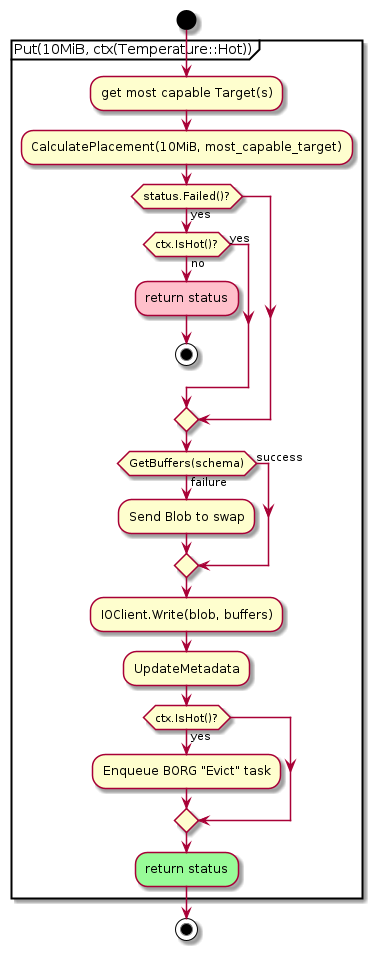
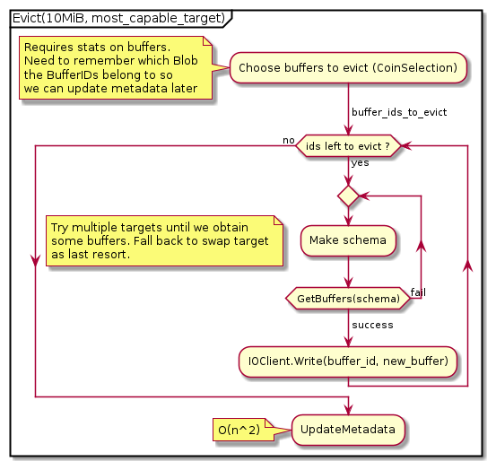

# Buffer Organizer

The **Buffer Organizer** is the "corrector" half of our
predictor/corrector model. It attempts to correct sub-optimal DPE
placements by moving data among buffers.

## Objectives

- Management of hierarchical buffering space
  - Data flushing
  - Read acceleration
- Manage data life cycle, or journey
  - When is the blob in equilibrium?
  - How do we eliminate unnecessary data movement?

## Blob Scoring

We attempt to meet the above objectives via a `Blob` scoring system. Each `Blob` has two different scores associated with it: the **importance score** and the **access score**.

### Importance Score

The importance score is a real number in the range [0, 1] where 0 represents a `Blob` that is not important to the user (i.e., it will not be accessed) and 1 represents a `Blob` that will be accessed either very frequently, very soon, or both.

#### Variables that might contribute to the importance score

- Blob Size
- Blob Name
- Recency of Blob access
- Frequency of Blob access
- User-supplied priority (this is only a hint, not a guarantee).

### Access Score

This is a real number in the range [0, 1] where 0 represents a `Blob` with the slowest access time (i.e., all its `Buffer`s are in the slowest tier) and 1 represents a `Blob` with the quickest access time (all the `Buffer`s are in the fastest tier).

#### Variables that contribute to the access score

- Bandwidth of the tiers that contain the `Blob`'s `Buffer`s.
- The `Blob` distribution (i.e., is all the data in a single `Buffer`, or is it spread out among multiple `Buffer`s on multiple nodes?).

### How the scores are used

The goal of the `BufferOrganizer` is to ensure that each `Blob`'s access score is closely aligned to its importance score.

## Ideas

- If a `Blob`'s `Bucket` has a reference count of 0 (i.e., no process has an open handle to the `Bucket`) then the importance score should be 0. The score is only calculated once at least one process opens the `Bucket`.

## Operations

All `BufferOrganizer` operations are implemented in terms of 3 simple
operators

- MOVE(BufferID, TargetID)
- COPY(BufferID, TargetID)
- DELETE(BufferID)

With these operators, we can build more complex tasks:

### Transfer

Move a `BufferID` from one set of `Target`s to another.

#### Who can initiate Transfer tasks?

- The System (load balancing)
- The User (producer/consumer)

### Evict(size_t bytes, Targets\[\])

Move a set of `BufferId`s from one set of `Target`s to an unspecified
location (could even be swap space).

#### Who can initiate Eviction tasks?

- Put (DPE)
- Get (Prefetcher)
- Thread that updates the `SystemViewState` (enforces a minimum
  capacity threshold passed in through the config).

#### Who translates an Eviction into a series of Transfers?

- DPE?
- BO?

#### Single shared file pros

- Could theoretically reap performance benefits of collective IO
  operations, although I don't think we'll ever be able to capitalize
  on this because each rank must act independently and can't
  synchronize with the other ranks.
- Less stress on the PFS metadata server.

#### File per rank pros

- Don't have to worry about reserving size for each rank.
- Don't have to worry about locking.

#### File per node

- We'll go with this for the initial implementation.
- Don't have to worry about locking or reserving size with respect to
  the buffer organizer. However, since multiple ranks could
  potentially write to the same swap file, we need to either
  - Filter all swap traffic through the buffer organizer
  - Synchronize all access to the file
- Won't overload the metadata servers as bad as file per rank.

## Triggers

The Buffer Organizer can be triggered in 3 ways:

### Periodic

The period can be controlled by a configuration variable.

### Client-triggered

- If, for any reason, a client DPE places data to the swap target, it
  will also trigger the buffer organizer by adding an event to the
  buffer organizer's queue.
- We store the blob name, the offset into the swap target (for
  file-based targets), and the blob size.
- When the buffer organizer processes an event, it

<!-- end list -->

1.  Reads the blob from the swap target into memory.
2.  Calls `Put` to place the blob into the hierarchy. If the `Put`
    fails, it tries again, up to `num_buffer_organizer_retries`
    (configurable) times.

### System-triggered

- Nothing is implemented yet.
- Should the BO constantly monitor the buffering hierarchy and attempt
  to maintain a set of rules (remaining capacity percentage,
  thresholds, etc.)?
- Should the BO simply carry out "orders" and not attempt to make its
  own decisions? If so, who gives the orders?
- Should the BO be available for other asynchronous tasks?

### Requirements for Queue implementation

- (At least) 2 different priority lanes
- Node local and remote queues (but only for neighborhoods, not global
  queues).
- Need ability to restrict queue length

## Design Details

### BO RPC Server

- RPC is used to route `BoTask`s to the appropriate Hermes core.

<!-- end list -->

- The `BO` RPC server only has one function:
  ```cpp
  bool EnqueueBoTask(BoTask task, Priority priority);
  ```

[[../images/bo_rpc.png]]

### Buffer Organizer

#### Work Queues

- Argobots **pool**s
- High and low priorities
- Basic FIFO queue by default
- Completely customizable (e.g., could be a priority queue, min-heap,
  etc.)

#### Schedulers

- Argobots **scheduler**s
- Takes tasks from the queues and runs them on OS threads as user
  level threads (basically coroutines).
- Completely customizable.
- By default, one scheduler is associated with a single execution
  stream (OS thread).
- Only take tasks from low priority queue if high priority queue is
  empty?

#### Threads

- Argobots **execution stream**s
- Bound to a **processing element** (CPU core or hyperthread), and
  shouldn't be oversubscribed.


## Example Flows

### Hot Put



### BO Eviction Flow



## Ideas

- An importance score of 0 could be the signal to flush a `Blob` to the PFS.
- `StageIn` and `StageOut` APIs
- Reverse "gravity" for read heavy workloads. `Blobs` trickle up to higher tiers.
- Explicitly maintain Target capacity thresholds.
- Introduce horizontal movement if Topology threshold is exceeded.

## Experiments

- Test the difference between flushing tier by tier vs skipping tiers. For example, a `Blob` moving from RAM to burst buffer could go through NVMe as an intermediate tier, or skip it altogether.
