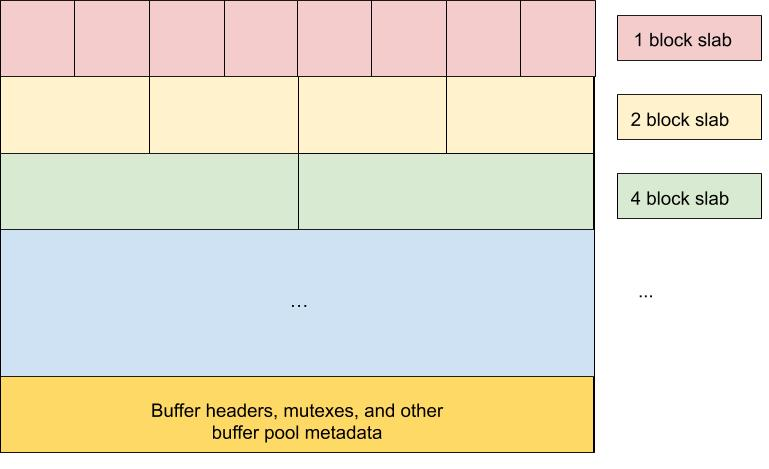

# Buffer Pool

The main idea behind the **Buffer Pool** is to avoid the runtime
overhead of memory allocation each time Hermes wishes to buffer data.
Instead, we pre-allocate a pool of fixed sized (though the size groups
are configurable) buffers that can be reused throughout an application
run. We allocate memory and reserve file system space on startup and
divide the available resources into buffers which the system can
request. We deploy one buffer pool per node for a given Hermes instance.

## Buffers and BufferIDs

A **_Buffer_** represents a portion of storage that Hermes is aware of
and is allowed to buffer data in. It can be backed by various storage
devices (RAM, NVMe, SSD, burst buffer, parallel file system, object
store, etc.). Each **_Buffer_** is identified by a globally unique (per
Hermes application instance) `BufferID` which is an unsigned 64 bit
integer divided into the following sections:

- 32 bits for the node ID. Each node is assigned a unique integer
  index (starting at 1, not 0) during Hermes initialization.
- 32 bits for header index. This is an index into the array of buffer
  headers on the corresponding node.

A `BufferID` of 0 (node id = 0 and header index = 0) signifies the NULL
`BufferID`.

## Buffer Pool Layout

- Terminology
  Block : A **block** is the smallest buffering unit available to
  Hermes. It defaults to the system's page size (usually 4 KiB on
  Linux) but can be configured to be any value.
  Slab : A **slab** is the collection of all buffers of the same block
  size. A typical setup would be a buffer pool with 4 slabs where the
  first slab is a collection of buffers that are 1 block each, the
  next slab consists of buffers of 4 blocks each, then 16-block
  buffers, and 32-block buffers. The number of slabs and number of
  blocks for each slab is configurable through a Hermes configuration
  file so that it can be tailored to each application's I/O pattern.



### Initialization

When Hermes initializes, it will read from the Hermes configuration file
how much space is available for buffering in each tier. The amount of
RAM available is allocated as 1 contiguous address space and split into
slabs and buffer pool metadata. The total amount of metadata is
calculated and reserved. The remaining space is split up into slabs,
according to the parameters in the configuration file. A free list is
maintained for each slab of buffers. Buffers are marked as in use or
not. When the system requests buffers, the buffer pool simply returns
the first item from the free list, and freeing buffers translates to
pushing them onto the head of the free list.

## API

The primary consumer of the buffer pool API is the Hermes API.
`Bucket::Put` is the primary path that will request buffers, and
`Bucket::Delete` will release buffers.

```cpp
std::vector<hermes::BufferID> GetBuffers(const hermes::PlacementSchema &schema);
void ReleaseBuffers(const std::vector<hermes::BufferID> &buffer_ids);
```

Most operations deal with `BufferID`s, but when the data itself must be
accessed (e.g., when an I/O client wises to flush buffers to the PFS)
each ID contains all the information required to get to the actual data.

- Split and Merge

In addition, if the system finds that small buffers are underutilized
while large buffers are exhausted, it can merge unused small buffers
into larger buffers for better utilization. Conversely, if large buffers
are underutilized, it can split large buffers into small buffers.

## Buffer Pool Visualizer

To facilitate testing and debugging, we've developed a tool to display a
graphical view of the state of a buffer pool. The buffer visualization
updates in real time by simply reading the buffer pool shared memory, so
we can watch how buffers get used and freed as an application executes,
and it can be attached and detached to/from any running application.
Below is a visualization of a buffer pool with 4 slabs. The red slab is
made of 1-block (4 KiB in this case) buffers, the yellow of 4-block
buffers, the green of 16 block buffers, and the blue of 32-block
buffers. Note that the relative sizes are preserved. The space above the
magenta line is directly mapped to the RAM buffers in shared memory.
Below the magenta line we see the total headers, including those in use
(green) and unused (grey). In the initial state, we have some unused
headers to facilitate splitting buffers.


Here we have merged the yellow 4-block slab into the green 16-block
slab. We can also see that fewer headers are in use because we now have
fewer buffers.


Here we have split all slabs into the smallest possible buffers,
resulting in one slab of 1-block buffers. Here every header is used, and
this is the maximum number of buffers the system can support for this
particular configuration.


Development on the visualizer occurs on an as-needed basis, but should
the need arise, it would be great to be able to zoom in and out, and
hover over buffers to see actual data.
