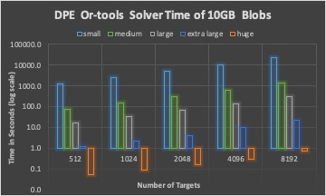
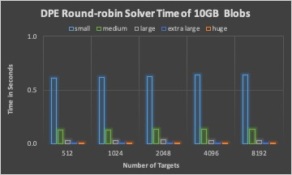
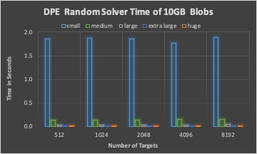
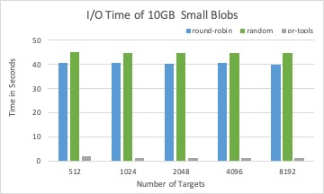
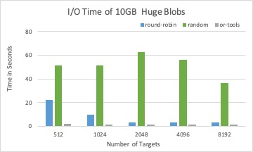

# Data Placement

Every Hermes system instance includes one or more Hermes _nodes_.

A _destination_ is a buffering resource that can be identified by a pair
of node + target "coordinates."

Each target $`t_k`$ has characteristics such as the following:

- A capacity $`Cap[t_k]`$
- A remaining capacity $`Rem[t_k]`$
- A speed (or throughput) $`Speed[...,t_k]`$
  - This is the mean of the throughputs of all ranks associated with
    the destination's node.
  - **Fix this\!** Speed is really a function of the origin.

**Note:** At any point in time, there's a degree of _uncertainty_ to
some of the destination characteristics. For example, the remaining
capacity of a destination is typically obtained from a global metadata (MD)
structure that is updated asynchronously. Only the Hermes node buffer
pool managers have the precise value(s) for the pool under their
management.

## The Data Placement Problem

Given _N_ storage targets, a data placement policy _P_, a cost function _F_, and a _BLOB_,
a data placement consists of a BLOB partitioning and an assignment of those parts to storage targets
that satisfies the constraints of the data placement policy and that minimizes the cost function.

- Epoch - interval within which we update targets (status).
  - Static (e.g., time interval or number of operations)
  - Dynamic, i.e., computed by the delta of status

\[optional\] Placement window - interval within which we make data
placement decisions.

- Timer expired or I/O operation count reached, which ever comes
  first.
- Static (e.g., time interval or number of operations)
- Dynamic, i.e., number of put operations

Epoch and placement window could be aligned (static mode).

The data placement is done within Data Placement Engine (DPE) component
in HERMES.

## The Data Placement Loop

A _placement schema_ $`PS(b)`$ of a BLOB $`b (>0)`$ is a decomposition
$`b = s_1+\cdots+s_k,\; s_i\in\mathbb{N}\setminus\{0\}`$ together with a
target mapping $`(s_1,\ldots,s_k)\mapsto(t_1(s_1),\ldots,t_k(s_k))`$.

A sequence of buffer IDs $`(ID_1,\ldots,ID_A)`$ _conforms_ to a target
assignment $`(s, t)`$, iff $`s = \sum_{i=1}^A Size(ID_i)`$ and
$`\forall i\;Target(ID_i) = t`$.

An _allocation of a placement schema_ is a sequence of buffer IDs which
is the concatenation of conforming target assignments.

1.  Given: a vector of BLOBs $`(b_1, b_2,\ldots, b_B)`$
2.  The DPE creates placement schemas $`PS(b_i),\;1\leq i\leq B`$.
3.  The placement schemas are presented to the buffer manager, which,
    for each placement schema, returns an allocation of that schema (or
    an error), and updates the underlying metadata structures.
4.  I/O clients transfer data from the BLOBs to the buffers.

## Problem to Solve in DPE

Input:

- Vector of BLOBs $`(b_1, b_2,\ldots, b_B)`$.
- Vector of targets $`(t_1, t_2,\ldots, t_D)`$.
- Vector of target remaining capacities $`Rem[t_k], \;1\leq k\leq D`$.
- Vector of target speed $`Speed[t_k], \;1\leq k\leq D`$.

Output:

- Placement schema
  $`(s_1,\ldots,s_k)\mapsto(t_1(s_1),\ldots,t_k(s_k))`$, where
  $`b (>0)`$ is a decomposition
  $`b = s_1+\cdots+s_k,\; s_i\in\mathbb{N}\setminus\{0\}`$

## Data Placement Solution

1.  Pick a DP solver to obtain a _placement schema_.
    - Linear programming
      - Constraints
      - Objective function
    - Round-robin
      - Granularity
    - Random
      - Distribution(s)
2.  Use the buffer pool's "coin selector" to convert into buffer IDs.
3.  Handle two types of potential errors.
    - DP solver failure: This can happen because of outdated target
      status, i.e., insufficient capacity, constraint infeasibility,
      etc.
      - Solution to insufficient capacity: epoch, decision windows,
        swap space.
      - Solution to constraint infeasibility: buffer reorganization,
        target filtering.
    - Coin selection failure: This can happen because of outdated
      state view information, e.g., outdated remaining capacities.
      - Solution: epoch, decision windows, swap space.

### Error Handling

In both cases, the list of targets is inappropriate and needs to be
updated or changed.

The list of "relevant destinations" for a rank is assembled by the
Hermes node _topology generator_. It gets triggered when DP fails. The
initial topology consists of "node-local" destinations (Plan A) plus a
backup list of neighbors (Plan B) to consult when a rank gets in
trouble. If both plans fail, the topology generator invokes the
_application-level_ "rebalancer" to redraw neighborhood boundaries
(Plan C). In the past, we used to call these components node- and
application-level DPEs, but they aren't directly involved in DP
decisions, and we need maybe a clearer terminology.

## Data Placement Solution Implementation

LP solver

- Pick Google OR-Tools as a linear optimization tool to obtain
  a *placement schema*.
  - Minimize client I/O time.

Round-robin solver

- Pick the next _target_ if the remaining capacity is greater or equal
  to the BLOB size, otherwise check the one after the next target
  until a target with enough capacity is found.

Random solver

- Randomly pick a target from all targets which have the capacity
  greater or equal to the BLOB size.

## Experimental Setup

Scaling the number of BLOBs, 10 GB total BLOB size

- Small size BLOBs: random within the range of 4KB to 64KB
- Medium size BLOBs: random within the range of 64KB to 1MB
- Large size BLOBs: random within the range of 1MB to 4MB
- Extra large size BLOBs: random with the range 4MB to 64MB
- Huge size BLOBs: fixed 1GB

Scaling the BLOB size, 1,000 and 8,192 BLOBs in total

- Fixed BLOB size of 4KB, 64KB, 1MB, 4MB, 64MB

## Experimental Results

The DPE time of three different solvers with 10GB BLOBs in total.

The associated I/O time of placement schema from three different solvers
with 10GB BLOBs in total.

The DPE time of three different solvers with 1,000 BLOBs in total.

The associated I/O time by placement schema by three different solvers
with 1,000 BLOBs in total.

## Conclusions

For a fixed total size of many BLOBs, DPE time is increasing with the
number of BLOBs for all solvers.

Round-robin and random solver can quickly calculate targets for a BLOB
than LP solver, while not considering optimizing I/O time.

LP solver is efficient when the search space (number of targets) is not
too large (for example, less than 1,024).

LP solver is a good candidate to place large size BLOBs, where the DPE
time has less impact than the I/O time to the overall performance.

One of the possible policies is that size 64KB could be a boundary for
BLOB aggregation. BLOB size less than 64KB will be aggregated within a
placement window and than placed together to mitigate DPE impact.

Another possible policy is to use round-robin or random for small blobs
and LP solver for large blobs.
