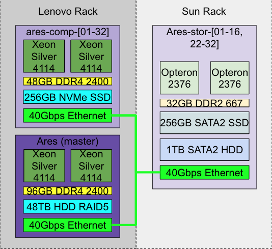
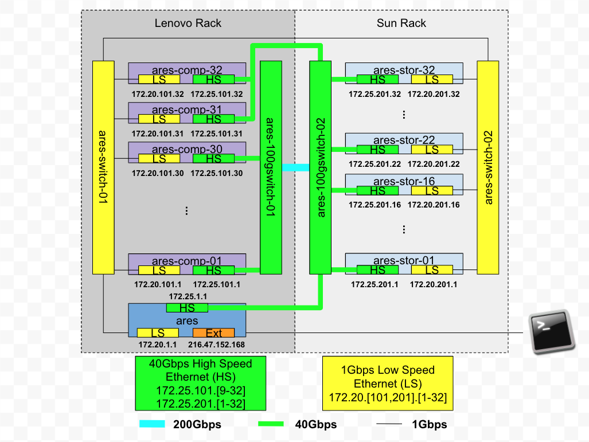

# Examples

## Ares (IIT)

<table>
<tr>
<th>
Compute Rack
</th>
<th>
Interconnect
</th>
<th>
Storage Rack
</th>
</tr>
<tr>
<td>
8x <strong>C1</strong> nodes w/ Samsung 960 Evo 250GB NVMe SSD
</td>
<td rowspan="2"><ul>
<li>1x 40 Gbps ethernet port</li>
<li>1x 1 Gbps ethernet</li>
<li>200Gbps uplink switch</li>
</ul></td>
<td rowspan="2"><ul>
<li>Seagate 1TB SATA HDD</li>
<li>Samsung 860 Evo 250GB SATA SSD</li>
</ul></td>
</tr>
<tr>
<td>
24x <strong>C2</strong> nodes w/ Toshiba OCZ RD400 256GB NVMe SSD
</td>
</tr>
</table>

- What kind of CPU(s)?
  - Intel Xeon silver 4114

<!-- end list -->

- How much memory and what kind?
  - 128GB DDR4-2400 (need to double check)
- What's the OS? (kernel version, etc.)
  - OpenHPC(GCC 4.8.5) on login and compute nodes, CentOS(GCC 7.3.0)
    and on storage nodes. (Need to double check)
- How is the system configured? (file systems, networking, etc.)
  - All nodes are equipped with one Mellanox 40Gbps adapter.
  - Each compute/storage node has one high-speed (40Gbps) Ethernet
    and one low-speed (1Gbps) Ethernet.
  - Compute node 31, 32 and the master node are connected to the
    high-speed switch in the storage rack.
  - Compute and storage nodes are connected to different switches
    which are connected with a 200Gbps uplink.
  - The network speed on the storage nodes are limited by the PCIe
    2.0 standard, which is around 1GB/s.
  - OrangeFS 2.9.7 has been installed into /opt/ohpc/pub/orangefs.
    Every user can run it and access it from MPI applications with
    proper configuration in the MPI library.

### Performance

#### Memory

RDMA max bandwidth is around 37 Gb/s.

Memory bandwidth ([STREAM
benchmark](https://www.cs.virginia.edu/stream/)):

- Compute node (Lenovo): 49 GB/s
  ([reference](https://docs.google.com/document/d/1QQPs-NwI-tqaUmA3CnpztY3i2pkVujSAVoliSnTBlPQ/edit))
- Storage node (Sun): 7GB/s
  ([reference](https://docs.google.com/document/d/1jkOKFvc7ueLkP6kjJgOhgK7k-LMq-jMIaTVuHmTzA5M/edit))

Memory latency ([TLB benchmark](https://github.com/torvalds/test-tlb)):

- Huge/regular page seq: 7ns
- Huge page rand: 92 ns
- Regular page rand: 108 ns
- [numbers are
  from](https://docs.google.com/spreadsheets/d/1piDh07T3fX5tlel4NdrsxvkFy_Ojopa1dbkN1X5AruE/edit#gid=0)

#### Storage

Disk bandwidth ([fio](https://fio.readthedocs.io/en/latest/fio_doc.html)
benchmark):

- [test script can be found](https://ares.cs.iit.edu/baseline-perf/)

<!-- end list -->

- [Compute node (Samsung
  NVMe)](https://ares.cs.iit.edu/baseline-perf/local_disk/comp-samsung-nvme.html)
  & [Compute node (Toshiba
  NVMe)](https://ares.cs.iit.edu/baseline-perf/local_disk/comp-toshiba-nvme.html):
  - Read max: 2.5GB/s
  - Write max: 1GB/s

<!-- end list -->

- [Storage node (Samsung SATA SSD) with PICe
  adapter](https://ares.cs.iit.edu/baseline-perf/local_disk/stor-ssd-pcie-sata.html)
  - Read/Write max: 400MB/s

<!-- end list -->

- [Storage node (Samsung SATA)
  HDD](https://ares.cs.iit.edu/baseline-perf/local_disk/stor-hdd-sata.html)
  - Read/Write max: 180MB/s

#### Networking

[Numbers are
from](https://docs.google.com/spreadsheets/d/1bngw2dXIamtT7rvPcultBxF5lyhubNCmK2BkkIr5vAc/edit#gid=686223677)

| Direction              | Latency (us) | Max Bandwidth (Gb/s) |
| ---------------------- | ------------ | -------------------- |
| Compute - compute node | 2            | 37                   |
| Compute - storage node | 6            | 10                   |
| Storage - storage node | 5            | 12.5                 |

## Chameleon (TACC)

The Chameleon architecture consists of a set of standard cloud units
(SCUs).

### Standard Cloud Units

- What kind of CPU(s)?
  - Each compute node is with 24 cores delivered in dual socket
    Intel Xeon E5-2670 v3 “Haswell” processors (each with 12 cores @
    2.3GHz)

<!-- end list -->

- How much memory and what kind?
  - 128 GiB of DDR4 RAM.

<!-- end list -->

- What's the OS? (kernel version, etc.)
  - OS is configurable by the user.

<!-- end list -->

- How is the system configured? (file systems, networking, etc.)
  - Every switch in the research network is a fully OpenFlow
    compliant programmable Dell S6000-ON switch.
  - Each node connects to this network at 10 Gbps, and each unit
    uplinks with 40Gbps per rack to the Chameleon core network.
  - The core switches (Dell S6000-ON) are connected by 40 Gbps
    Ethernet links, which connect to the backbone 100Gbps services
    at both UC and TACC.
  - Chameleon also provides a shared storage system. The shared
    storage provides more than 3.6PB of raw disk.
  - Heterogeneous Compute Hardware
    - The heterogeneous hardware includes various technologies:
      GPU and FPGA accelerators, SSD and NVMe storage, low-power
      ARM, Atom, and Xeon systems-on-a-chip.
    - The two storage hierarchy nodes have been designed to enable
      experiments using multiple layers of caching: they are
      configured with 512 GiB of memory, two Intel P3700 NVMe of 2
      TB each, four Intel S3610 SSDs of 1.6 TB each, and four 15K
      SAS HDDs of 600 GB each.

## Tier Characterization

A tier is a class of storage devices that share certain characteristics
including:

| Symbol | Description         | Unit | Comment             |
| ------ | ------------------- | ---- | ------------------- |
| L      | Latency             | ns   | How is it measured? |
| B      | Bandwidth           | GB/s | How is it measured? |
| C      | Total capacity      | GB   |                     |
| Q      | Request queue depth | n/a  |                     |

The previous characteristics are considered constant during a Hermes
session. In addition, the following time-dependent characteristics are
considered:

| Symbol | Description        | Unit | Comment |
| ------ | ------------------ | ---- | ------- |
| R      | Remaining capacity | GB   |         |
| F      | Request queue fill | %    |         |

To keep the terminology simple, we will refer to the storage devices of
a certain tier class collectively as "the tier."

Tiers are (pairwise) disjoint, i.e., no storage device can belong to
more than one tier.

There are intra-tier and inter-tier connections (i.e., between tiers via
suitable buses or interconnects). Data transfer via these connections
may or may not require CPU intervention.

The grouping of storage devices into tiers has nothing to do with the
physical distribution of the devices. For example, the fact that two
storage devices are of RAM-class doesn't say anything about their
"proximity", which is defined by the intra-tier connectivity.

## Layer (Level?)

In Hermes, it is intuitive to define the "storage device distance" of a
storage device from an application or permanent storage port, and
storage devices can be ranked or sorted by their distance from such a
port. By grouping together storage devices of the same or similar
distance from a given port, one can identify _layers_ or _levels._ The
distance is defined relative to a port: The storage world "looks"
different from different ports, i.e., the same storage device will
generally have different distances from different ports. Since some of
the storage device characteristics which enter into the storage device
distance are time-dependent, the corrsponding layer structure is
time-dependent as well\!
