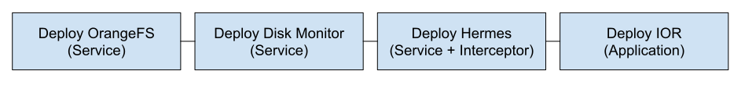

# Design & Motivation

First we will describe how `jarvis-cd` is organized and the files that it creates.

## Jarvis Config

The Jarvis configuration file is stored under `${JARVIS_ROOT}/config/jarvis_config.yaml`.
It stores the `${CONFIG_DIR}`, `${PRIVATE_DIR}`, and `${SHARED_DIR}` variables described in the Home page.
Additionally, it stores the currently-active hostfile and the set of repos to search for pkgs.
This file essentially determines where Jarvis will store metadata for pipelines.

The resource graph for the current machine is stored under `${JARVIS_ROOT}/config/resource_graph.yaml`.
The resource graph stores information about the machine state, including hardware and networks.

## `Pkg`s

Jarvis-cd deploys complex applications. In Jarvis, we consider applications
"`pkg`s". `Pkg`s can be connected to form a pipeline, which is a series of
applications to deploy all at once.

Jarvis has three general `pkg` types:

1. Service: a program which runs forever, until forcibly stopped.
2. Application: a program which runs to a definite completion.
   For example, run IOR over OrangeFS, BeeGFS, and Hermes.
3. Interceptor: Used to intercept code for a benchmark or storage system.

## Pipelines

Jarvis-cd provides a CLI to create pipelines. A pipeline specifies an
ordered set of configured pkgs to execute. An example of a jarvis pipeline
would be as follows:



## Service Pkgs

Service pkgs represent long-running applications. An example would be a storage system.

Storage systems have complex configurations:

1. What pkgs do metadata servers go on?
2. What pkgs do storage server go on?
3. What storage devices do we use?
4. What interface should the storage device expose? Filesystem? Block device?
5. What networking protocol do we use?
6. How many threads to use?
7. The list goes on and on.

To make matters worse, each storage system has different ways to represent this
information. Each machine has different paths, different network cards,
different IPs, etc. How do we simplify the deployment of these complex systems?

At the end of the day, there's no way to get around having a configuration
file. For each storage system, we store configuration files. These
files are stored in the `${PRIVATE_DIR}` and `${SHARED_DIR}` directories stored
in the jarvis configuration.

```bash
jarvis pipeline create ofs-global
jarvis pipeline append orangefs
jarvis pipeline start &
jarvis pipeline stop
```

## Application Pkgs

Applications can include:

- benchmarks
- simulation codes

```bash
jarvis pipeline create my-benchmark
jarvis cd my-benchmark
jarvis pipeline append orangefs
jarvis pipeline append hermes
jarvis pipeline append ior
```

## Interceptor Pkgs

A library can be used to intercept or monitor some functionality of an
application. For example, a library may include

```bash
jarvis pipeline create my-app
jarvis cd my-app
jarvis pipeline append orangefs \
  client_path=${HOME}/llogan/pfs
jarvis pipeline append hermes
jarvis pipeline append monitor
jarvis pipeline append qmcpack
jarvis pipeline run
```

## Pipeline Metadata

When creating a pipeline, metadata for the pipeline will be created under
the `${CONFIG_DIR}` from the jarvis config.

The metadata for the currently-focused pipeline.

```bash
jarvis create my-pipeline
ls `jarvis path`
```

This will print all folders and files relevant to `my-pipeline`.

When adding pkgs to the pipeline, sub-folders will be created for each individual pkg.
For example, the following will print all files used by the hermes pkg.

```bash
jarvis append hermes
ls `jarvis path`/hermes
```
